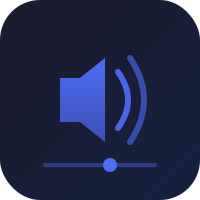
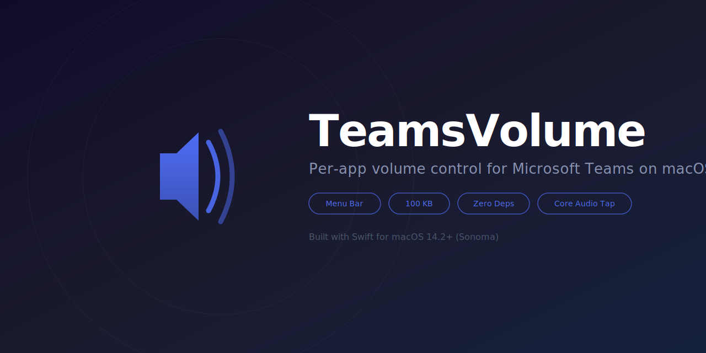
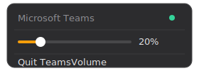

<p align="center">
  
</p>

<h1 align="center">TeamsVolume</h1>

<p align="center">
  <strong>Per-app volume control for Microsoft Teams on macOS</strong>
</p>

<p align="center">
  <a href="#installation"></a>
  <a href="LICENSE"></a>
  <a href="TeamsVolume.swift"></a>
  <a href="TeamsVolume.swift"></a>
  <a href="#installation"></a>
  <a href="#install-with-homebrew"></a>
</p>

<p align="center">
  
</p>

---

## Why TeamsVolume?

macOS has **no built-in per-app volume control**. When Microsoft Teams blasts notification sounds or a colleague's audio is too loud, your only option is the system-wide volume slider. TeamsVolume fixes this.

- **Independent volume control** — Lower Teams volume without affecting Spotify, YouTube, or anything else.
- **Menu bar slider** — Click the icon, drag the slider. Real-time volume adjustment.
- **Native Core Audio Tap** — Uses Apple's new Core Audio Tap API (macOS 14.2+). No kernel extensions, no audio drivers, no hacks.
- **Lightweight** — ~100 KB binary compiled from a single Swift file. No Electron, no bloat.
- **Zero dependencies** — Built with native macOS frameworks. Nothing to install except the app itself.
- **Auto-detect** — Automatically finds Teams when it starts, reconnects if Teams restarts.
- **Clean audio** — Volume ramping prevents clicks and pops when adjusting.
- **Privacy-first** — Runs locally, no network access, no analytics, no data collection.

## How It Works

<p align="center">
  
  <br>
  
</p>

| Action | Result |
|--------|--------|
| **Left-click** | Show volume slider menu |
| **Drag slider** | Adjust Teams volume (0-100%) |
| **Right-click** | Show quit menu |

### Under the Hood

1. Finds Microsoft Teams process via PID lookup
2. Translates PID to `AudioObjectID` using Core Audio API
3. Creates a `CATapDescription` with `muteBehavior = .mutedWhenTapped` (intercepts Teams audio)
4. Builds an aggregate device with the tap attached
5. In the real-time audio callback, multiplies each sample by the volume gain factor
6. Outputs processed audio to your speakers/headphones

When you quit TeamsVolume, the tap is destroyed and Teams audio returns to normal.

## Installation

### Install with Homebrew

```bash
brew tap bahmetpalanci/tap
brew install teams-volume
open $(brew --prefix)/opt/teams-volume/TeamsVolume.app
```

### Install from Source

```bash
git clone https://github.com/bahmetpalanci/teams-volume.git
cd teams-volume
bash build.sh
open TeamsVolume.app
```

### Auto-Start on Login

```bash
bash install.sh
```

### Uninstall

```bash
bash uninstall.sh
```

### First Launch — Screen Recording Permission

On first launch, macOS will ask for **Screen & System Audio Recording** permission. This is required for the Core Audio Tap API to capture app audio.

1. Open **System Settings → Privacy & Security → Screen & System Audio Recording**
2. Enable **TeamsVolume**
3. Relaunch the app when prompted

This permission is only asked once.

### Requirements

- **macOS 14.2 (Sonoma)** or later (Core Audio Tap API)
- Xcode Command Line Tools (`xcode-select --install`)

## Build from Source

TeamsVolume is a single Swift file that compiles to a native macOS app:

```bash
# Clone
git clone https://github.com/bahmetpalanci/teams-volume.git
cd teams-volume

# Build (creates TeamsVolume.app)
bash build.sh

# Run
open TeamsVolume.app
```

The entire source code is in [`TeamsVolume.swift`](TeamsVolume.swift) — a single file, ~560 lines.

## Project Structure

```
teams-volume/
├── TeamsVolume.swift          # Complete source code (single file)
├── build.sh                   # Build script
├── install.sh                 # Install as login item
├── uninstall.sh               # Remove login item
├── TeamsVolume.app/           # App bundle
│   └── Contents/
│       ├── Info.plist
│       ├── Resources/AppIcon.icns
│       └── MacOS/TeamsVolume
├── assets/                    # Logo and screenshots
└── README.md
```

## How It's Built

TeamsVolume uses native macOS APIs:

- **Core Audio Tap API** — `CATapDescription` + `AudioHardwareCreateProcessTap` to intercept app audio (macOS 14.2+)
- **Aggregate Device** — Routes tapped audio through a custom IO proc for gain processing
- **`NSStatusItem`** — Places the icon in the menu bar
- **SF Symbols** — Native `speaker.wave.X.fill` icons that reflect current volume level
- **`NSSlider`** — Embedded in menu for real-time volume control
- **Volume Ramping** — Exponential smoothing prevents clicks on volume changes
- **LaunchAgent** — Auto-start on login via standard macOS mechanism

No frameworks, no package managers, no build systems. Just `swiftc`.

## FAQ

<details>
<summary><strong>Does it affect audio quality?</strong></summary>
No. TeamsVolume applies a simple linear gain to each audio sample. At 100% volume, the audio passes through completely unmodified. There is no resampling, compression, or format conversion.
</details>

<details>
<summary><strong>Does it work with other apps besides Teams?</strong></summary>
Currently hardcoded for Microsoft Teams, but the Core Audio Tap approach works with any app. Future versions may support multiple apps.
</details>

<details>
<summary><strong>Why macOS 14.2 minimum?</strong></summary>
The Core Audio Tap API (<code>CATapDescription</code>, <code>AudioHardwareCreateProcessTap</code>) was introduced in macOS 14.2 (Sonoma). There is no way to achieve per-app volume control on older macOS versions without kernel extensions or virtual audio drivers.
</details>

<details>
<summary><strong>Does it need special permissions?</strong></summary>
Yes — <strong>Screen & System Audio Recording</strong> permission is required. macOS will prompt you on first launch. This is needed for the Core Audio Tap API to intercept app audio. No microphone access or accessibility permissions are needed.
</details>

<details>
<summary><strong>What happens when Teams is not running?</strong></summary>
TeamsVolume shows "searching..." in the menu and polls every 3 seconds. When Teams starts, it automatically connects the audio tap.
</details>

<details>
<summary><strong>What happens when I quit TeamsVolume?</strong></summary>
The audio tap is destroyed and Teams audio immediately returns to normal system volume. No residual effects.
</details>

## Alternatives

| App | Size | Price | Per-App Volume | Open Source | No Drivers |
|-----|------|-------|---------------|-------------|------------|
| **TeamsVolume** | **100 KB** | **Free** | **Yes** | **Yes** | **Yes** |
| Background Music | 5 MB | Free | Yes | Yes | No (virtual driver) |
| SoundSource | 25 MB | $39 | Yes | No | No (kernel ext) |
| eqMac | 30 MB | Freemium | Yes | Partial | No (virtual driver) |

## See Also

- [MicMute](https://github.com/bahmetpalanci/mic-mute) — One-click microphone mute/unmute for macOS menu bar (same author, same philosophy)

## Contributing

Contributions are welcome! Feel free to open an issue or submit a pull request.

## License

[MIT](LICENSE) — Use it however you want.

---

<p align="center">
  <sub>Built with Swift and native macOS Core Audio APIs</sub>
</p>
